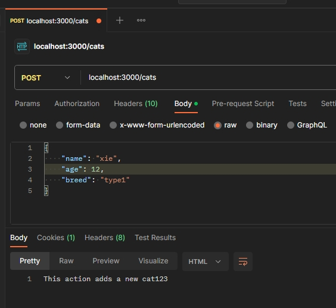

管道是用 @Injectable() 装饰器注释的类，它实现了 PipeTransform 接口。

## 使用场景

- transformation: 将输入数据转换为所需的形式（例如，从字符串到整数）
- validation: 评估输入数据，如果有效，只需将其原样传递； 否则抛出异常

## 绑定管道

以[内置管道](https://nest.nodejs.cn/pipes#%E5%86%85%E7%BD%AE%E7%AE%A1%E9%81%93) `ParseIntPipe` 例子

```ts
import { ParseIntPipe } from "@nest/common"

@Get(':id')
async findOne(@Param('id', ParseIntPipe) id: number) {  // [!code focus]
  return this.catsService.findOne(id);
}
```

假设 `GET localhost:3000/abc`，则会收到验证报错。

```json
{
  "statusCode": 400,
  "message": "Validation failed (numeric string is expected)",
  "error": "Bad Request"
}
```

## 对象模式验证

构建一个使用基于 [Zod](https://zod.dev/) 的模式的验证管道。

安装 zod `npm install --save zod`

::: code-group

```ts [创建管道]
// zod-validation.pip.ts
import {
  PipeTransform,
  ArgumentMetadata,
  BadRequestException,
} from '@nestjs/common';
import { ZodObject } from 'zod';

export class ZodValidationPipe implements PipeTransform {
  // DI
  constructor(private schema: ZodObject<any>) {}

  transform(value: unknown, metadata: ArgumentMetadata) {
    try {
      this.schema.parse(value);
    } catch (error) {
      throw new BadRequestException('Validation failed');
    }
    return value;
  }
}
```

```ts [修改DTO]
// create-cat.dto.ts
import { z } from 'zod';

export const createCatSchema = z
  .object({
    name: z.string(),
    age: z.number(),
    breed: z.string(),
  })
  .required();

export type CreateCatDto = z.infer<typeof createCatSchema>;
```

```ts [绑定管道]
// cats.controller.ts
@Post()
@UsePipes(new ZodValidationPipe(createCatSchema))
create(@Body() createCatDto: CreateCatDto) {
  return this.catsService.create(createCatDto);
}

```

:::

使用 `postman` 测试



## [类验证器](https://nest.nodejs.cn/pipes#%E7%B1%BB%E9%AA%8C%E8%AF%81%E5%99%A8)

验证技术的替代实现

::: code-group

```ts [创建管道]
// class-validation.dto.ts
import {
  PipeTransform,
  Injectable,
  ArgumentMetadata,
  BadRequestException,
} from '@nestjs/common';
import { validate } from 'class-validator';
import { plainToInstance } from 'class-transformer';

@Injectable()
export class ClassValidationPipe implements PipeTransform<any> {
  // Nest 支持同步和 asynchronous 管道
  async transform(value: any, { metatype }: ArgumentMetadata) {
    if (!metatype || !this.toValidate(metatype)) {
      return value;
    }
    const object = plainToInstance(metatype, value);
    const errors = await validate(object);
    if (errors.length > 0) {
      throw new BadRequestException('Validation failed');
    }
    return value;
  }

  private toValidate(metatype: Function): boolean {
    const types: Function[] = [String, Boolean, Number, Array, Object];
    return !types.includes(metatype);
  }
}
```

```ts [修改dto]
// create-cat.dto.ts
import { IsString, IsInt } from 'class-validator';
export class CreateCatUseClassValidatorDto {
  @IsString()
  name: string;

  @IsInt()
  age: number;

  @IsString()
  breed: string;
}
```

```ts [局部绑定]
// cats.controller.ts
import {
  CreateCatUseClassValidatorDto,
} from './dto/create-cat.dto';

@Post('create-use-class-validator')
create2(
  @Body(ClassValidationPipe)
  createCatUseClassValidatorDto: CreateCatUseClassValidatorDto,
) {
  return this.catsService.create2(createCatUseClassValidatorDto);
}
```

```ts [全局绑定]
// main.js

import { CreateCatUseClassValidatorDto } from 'dto/create-cat.dto';

async function bootstrap() {
  const app = await NestFactory.create(AppModule);
  app.useGlobalPipes(new createCatUseClassValidatorDto());
  await app.listen(3000);
}
bootstrap();
```

:::

## 对比`joi zod class-validator`[GPT3.5]

`Joi`, `class-validator`, 和 `zod` 都是用于在 JavaScript 和 TypeScript 应用程序中进行数据验证的库。它们有一些相似之处，但也有一些区别。

1. **joi**
   - **特点：** Joi 是一个功能强大且灵活的验证库，最初是为 Node.js 设计的，但也可以在浏览器中使用。它具有流畅的 API，允许您以链式方式定义验证规则。
   - **使用场景：** Joi 通常用于在服务器端验证输入数据，例如 HTTP 请求的有效性。它可以用于验证 JavaScript 对象的各个属性，确保它们符合指定的规则。
   - **示例：**

```js
const Joi = require('joi');

const schema = Joi.object({
  username: Joi.string().alphanum().min(3).max(30).required(),
  password: Joi.string().pattern(new RegExp('^[a-zA-Z0-9]{3,30}$')).required(),
});
```

2. **Class-validator:**

   - **特点：** Class-validator 是一个专为 TypeScript 设计的库，允许您使用装饰器为您的类添加验证规则。它通常与类和对象一起使用，使得验证更加面向对象。
   - **使用场景：** Class-validator 主要用于在应用中使用类和对象时进行验证。通过在类属性上使用装饰器，您可以指定验证规则。
   - **示例：**

     ```typescript
     import {
       IsString,
       IsNotEmpty,
       MinLength,
       MaxLength,
     } from 'class-validator';

     class User {
       @IsNotEmpty()
       @IsString()
       @MinLength(3)
       @MaxLength(30)
       username: string;

       @IsNotEmpty()
       @IsString()
       @MinLength(6)
       password: string;
     }
     ```

3. **Zod:**

   - **特点：** Zod 是一个使用 TypeScript 构建的声明式验证库。它通过使用类似于编程语言的语法来定义验证规则，使其易于理解和编写。
   - **使用场景：** Zod 适用于在 TypeScript 项目中进行验证，尤其是在运行时执行验证。它允许您定义 schema，并使用它来验证数据。
   - **示例：**

     ```typescript
     import { z } from 'zod';

     const userSchema = z.object({
       username: z.string().min(3).max(30),
       password: z.string().min(6),
     });
     ```

**联系：**

- 所有这三个库都专注于在运行时执行验证，确保数据的一致性和有效性。
- 它们都支持异步验证。
- Joi 和 Zod 在浏览器环境中也可以使用，而 Class-validator 主要针对服务器端开发。

**区别：**

- Joi 是链式 API 风格，适用于 JavaScript 和 Node.js，而 Class-validator 和 Zod 是 TypeScript 优先的，支持使用装饰器或声明式语法。
- Class-validator 更侧重于使用装饰器和类进行验证，而 Joi 和 Zod 更灵活，可以直接操作 schema 或对象。
- Zod 更强调声明式的验证，使用类似于 TypeScript 的语法来定义 schema，而 Joi 和 Class-validator 更具有过程式的 API。

选择使用哪个库通常取决于您的项目需求、团队的技术栈和个人偏好。

## 其他参考

[转换用例](https://nest.nodejs.cn/pipes#%E8%BD%AC%E6%8D%A2%E7%94%A8%E4%BE%8B)

[定制管道](https://nest.nodejs.cn/pipes#%E5%AE%9A%E5%88%B6%E7%AE%A1%E9%81%93)

[提供默认值](https://nest.nodejs.cn/pipes#%E6%8F%90%E4%BE%9B%E9%BB%98%E8%AE%A4%E5%80%BC)
